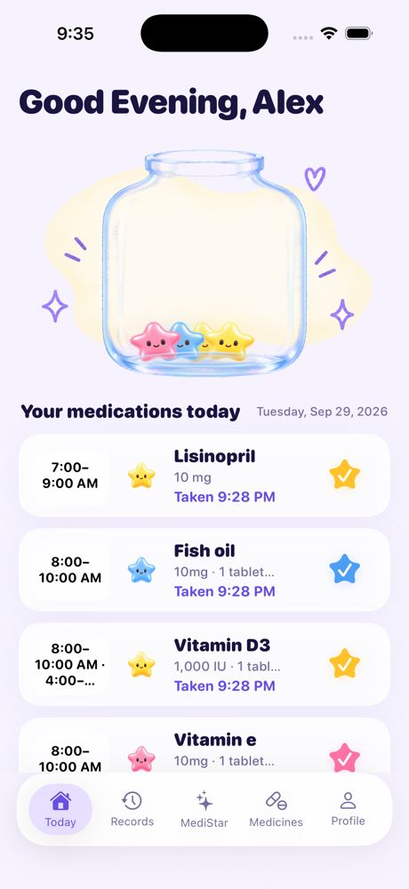
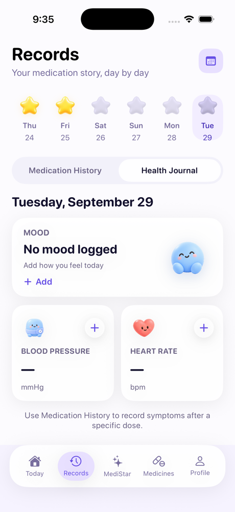
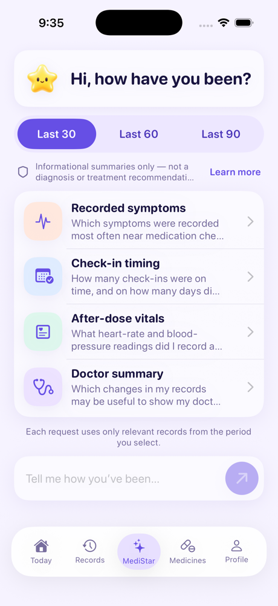

# MediStar

MediStar is a native SwiftUI medication companion that helps people remember their medicine, record how they feel, and turn their own health history into a clear summary they can review or share with a doctor.

The app combines a friendly, low-pressure interface with a privacy-conscious AI agent. Medication check-ins, moods, post-dose feelings, symptoms, and optional vital readings are entered by the user and remain the source of truth. The agent organizes those records; it does not invent health data, diagnose a condition, or recommend changing treatment.

## Product preview

<table>
  <tr>
    <td></td>
    <td></td>
    <td></td>
  </tr>
  <tr>
    <td align="center"><strong>Today</strong></td>
    <td align="center"><strong>Records</strong></td>
    <td align="center"><strong>MediStar agent</strong></td>
  </tr>
</table>

The screenshots show illustrative records entered through the app. Normal launches do not seed hard-coded medicines, symptoms, health readings, or assistant answers.

## What MediStar includes

- **Today** — see scheduled doses, mark a medicine as taken, and keep supply counts in sync.
- **Records** — browse medication history by date. A day earns a yellow star only after every required scheduled dose has been taken, whether it was early, on time, or late.
- **Health Journal** — record a daily mood plus optional blood pressure and heart rate separately from medication check-ins.
- **Post-dose notes** — attach a user-entered feeling or symptom to a specific completed dose.
- **Medicines** — add and edit medicines, schedules, dosage, reminders, and supply; restore an ended medicine or remove it permanently.
- **MediStar agent** — ask about symptoms, medication consistency, post-dose vital readings, or changes that may be useful to discuss with a doctor.
- **Local persistence** — SwiftData stores medicine definitions, medication records, and health-journal entries on the device with CloudKit disabled.

## How the MediStar agent works

The assistant is a records summarizer backed by FastAPI and the OpenAI Responses API. It uses a hybrid pipeline so arithmetic and health-record relationships are calculated by application code rather than guessed by the model.

```mermaid
flowchart LR
    A[User records doses, mood, feelings, symptoms, and optional vitals] --> B[SwiftData on device]
    B --> C[User chooses a 30, 60, or 90-day period and asks a question]
    C --> D[App sends only relevant records with active consent]
    D --> E[FastAPI verifies Apple identity and request scope]
    E --> F[Deterministic code calculates counts, dates, timing, links, and ranges]
    F --> G[OpenAI agent turns verified facts into clear language]
    G --> H[Server validates safety, evidence, and structured tables]
    H --> I[App displays the answer without changing source records]
```



### Records the agent can summarize

| User-created record | What the backend derives |
| --- | --- |
| Completed medication check-ins | Taken counts and exact completion dates |
| Scheduled dose windows | Early, on-time, late, and missing-dose details |
| Feelings saved with a dose | Repeated post-dose feelings grouped by medicine |
| Symptoms linked to a dose | Symptom counts, medicine association, and recorded timing relationship |
| Daily mood entries | Mood patterns within the selected period |
| Heart rate and blood pressure | Recorded counts and ranges, including readings linked to a medicine |

The backend first produces deterministic `recordFacts` and structured tables from the submitted records. The model receives that compact source of truth with an explicit rule not to calculate or infer new statistics. It is used to phrase a clear, warm response—not to manufacture moods, symptoms, medication events, or vital readings.

### Safety and privacy boundaries

- The user must opt in to **Allow AI analysis** before health records are sent.
- Each request contains only records relevant to the selected date range and question.
- Sign in with Apple authenticates assistant requests with a cryptographic nonce.
- Free-text questions pass through safety classification and moderation; generated prose is checked again before display.
- The server validates structured output and evidence references, and supplies its own fixed informational disclaimer.
- The agent does not diagnose, interpret a reading as a disease, or recommend starting, stopping, or changing medication.
- Requests use `store=False`. The backend does not persist health payloads, full questions, identity tokens, nonces, or model output.

Implementation entry points:

- [`RecordsAnalysisService.swift`](MediStar/Services/RecordsAnalysisService.swift) prepares the minimum date-bounded request from local records.
- [`record_summary.py`](MediStarBackend/app/services/record_summary.py) computes factual counts and evidence.
- [`model_context.py`](MediStarBackend/app/services/model_context.py) builds compact model facts and structured result tables.
- [`assistant_service.py`](MediStarBackend/app/services/assistant_service.py) runs safety checks, calls the Responses API, and validates the answer.
- [`main.py`](MediStarBackend/app/main.py) exposes the authenticated `POST /v1/assistant/analyze` endpoint.

## Requirements

- Xcode with the iOS 26.5 SDK; the current deployment target is iOS 26.5.
- macOS with an iOS Simulator or connected iPhone.
- Python 3.11 or newer for the optional assistant backend.
- An OpenAI API key and configured Sign in with Apple client ID to use AI analysis.

## Run the iOS app

1. Open `MediStar.xcodeproj` in Xcode.
2. Select the **MediStar** scheme and an iOS Simulator or connected device.
3. Build and run with **Command-R**.

The app creates its SwiftData `ModelContainer` in `MediStar/App/MediStarApp.swift` and registers `MedicineEntity`, `MedicationRecordEntity`, and `HealthJournalEntryEntity`.

In Debug builds, the assistant defaults to `http://127.0.0.1:8000` when `MEDISTAR_API_BASE_URL` is absent. To use another server, set that generated Info.plist key through the build configuration. Production builds accept a configured HTTPS endpoint only.

## Run the assistant backend

```bash
cd MediStarBackend
python3 -m venv .venv
source .venv/bin/activate
pip install -e '.[dev]'
cp .env.example .env
```

Add `OPENAI_API_KEY` to `.env`, confirm that `APPLE_CLIENT_ID` matches the app's Sign in with Apple client ID, then start the API:

```bash
uvicorn app.main:app --reload --port 8000 --no-access-log
```

Check the server and run its tests:

```bash
curl http://localhost:8000/health
pytest -q
```

The endpoint intentionally returns `503` when `OPENAI_API_KEY` is not configured. Never add a real API key to the iOS app or source control. More backend details are in [`MediStarBackend/README.md`](MediStarBackend/README.md).

## Project structure

```text
PillMate/
├── MediStar/
│   ├── App/             App entry point and SwiftData container
│   ├── Models/          SwiftData entities and medication value types
│   ├── ViewModels/      Feature state and presentation logic
│   ├── Views/           Today, Records, Medicines, Assistant, and Profile
│   ├── Components/      Shared cards, controls, colors, and characters
│   ├── Services/        Persistence, assistant, and notification services
│   └── Assets.xcassets/ Character artwork and app icon assets
├── MediStarBackend/
│   ├── app/             FastAPI routes, schemas, auth, safety, and agent pipeline
│   └── tests/           Backend behavior, privacy, safety, and integration tests
├── docs/                Product policies, examples, and README screenshots
└── MediStar.xcodeproj/  Xcode project
```

## Data behavior

Ending a medicine marks it inactive while preserving its medication history. **Delete forever** removes the medicine definition, while previously saved medication records remain available in Records. Inactive or permanently deleted medicines do not appear in the active Today list.

Profile → **Privacy & data** can permanently delete all SwiftData records, preferences, local profile and sign-in state, AI consent, and local reminders. The app then returns to onboarding with an empty local store.

## Current platform notes

- Local notification scheduling remains an abstraction point and still needs to be connected to the platform notification APIs.
- Future-date schedule generation is not yet a separate scheduling engine; Records displays saved records for the selected date.
- Before testing a real Apple sign-in, enable **Sign in with Apple** for the MediStar target and App ID, then regenerate the provisioning profile.
- The current backend rate limiter is in memory. A multi-worker deployment should replace it with a shared atomic store.

## Product and safety references

- [Assistant product and safety boundary](docs/assistant-product-safety-boundary.md)
- [Privacy, consent, and deletion draft](docs/privacy-consent-and-deletion-draft.md)
- [Normative question and status examples](docs/assistant-question-examples.json)
